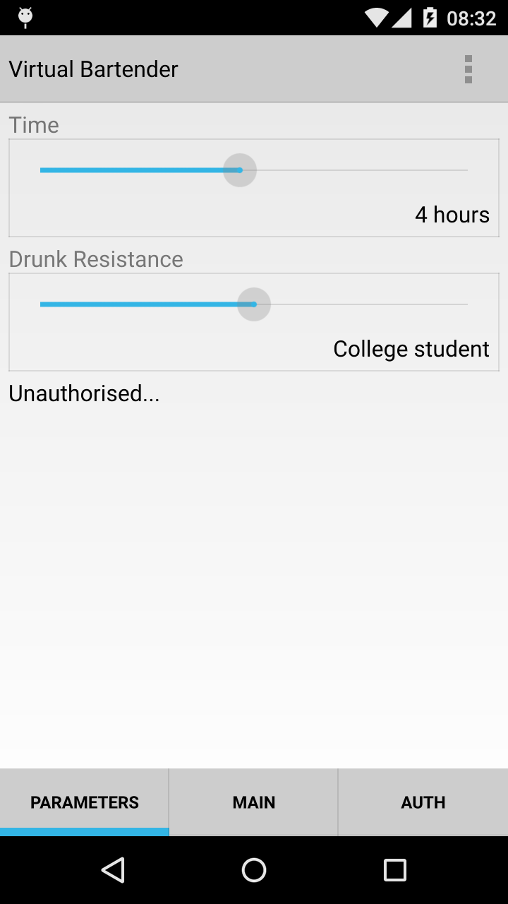
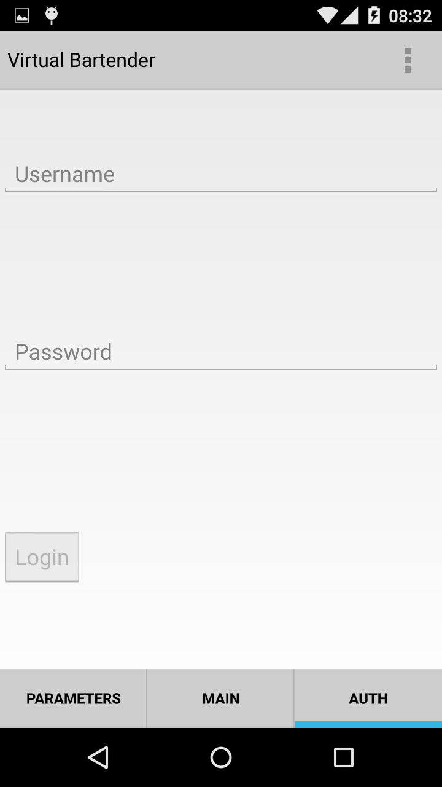
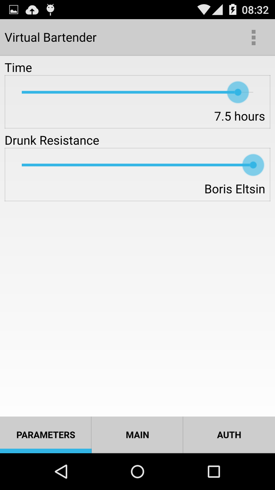
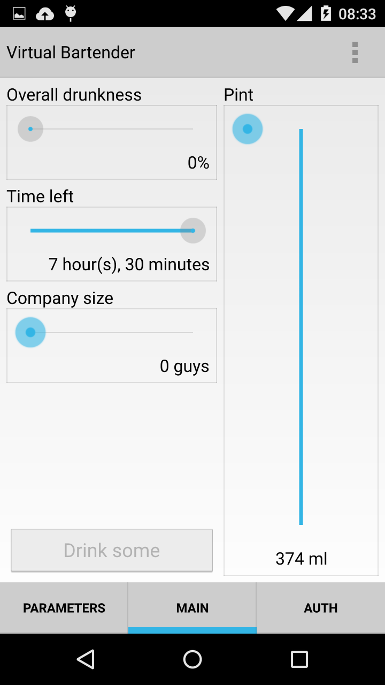
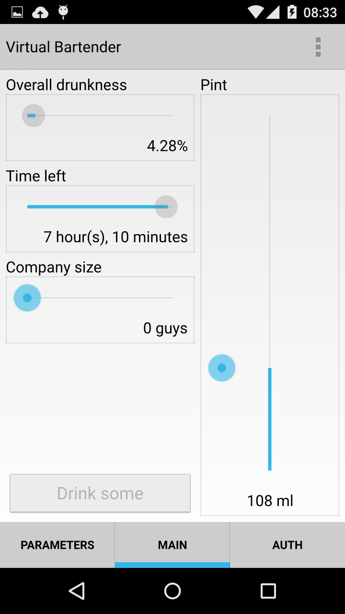
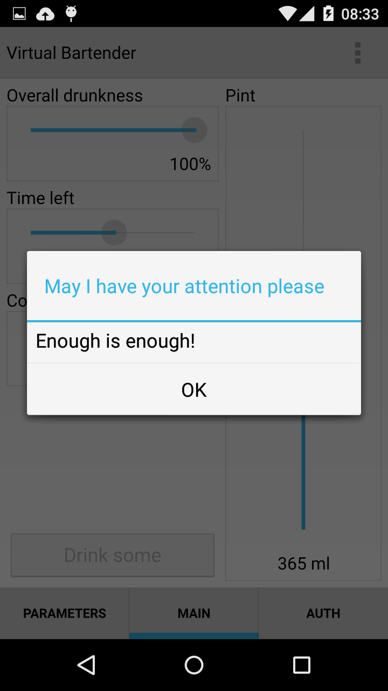
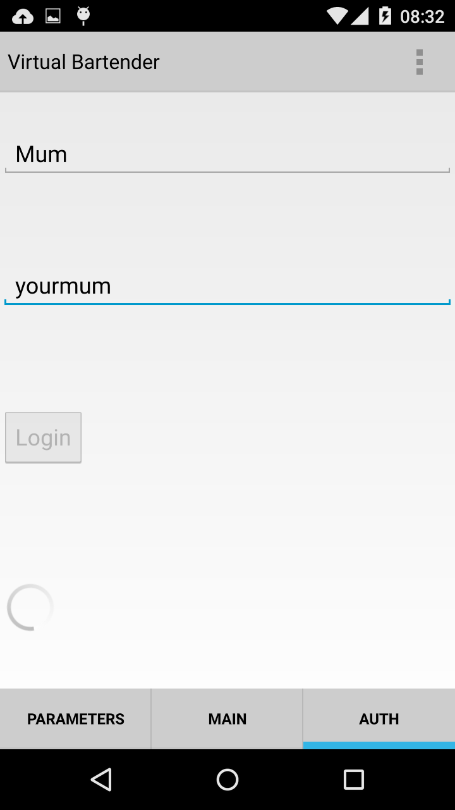
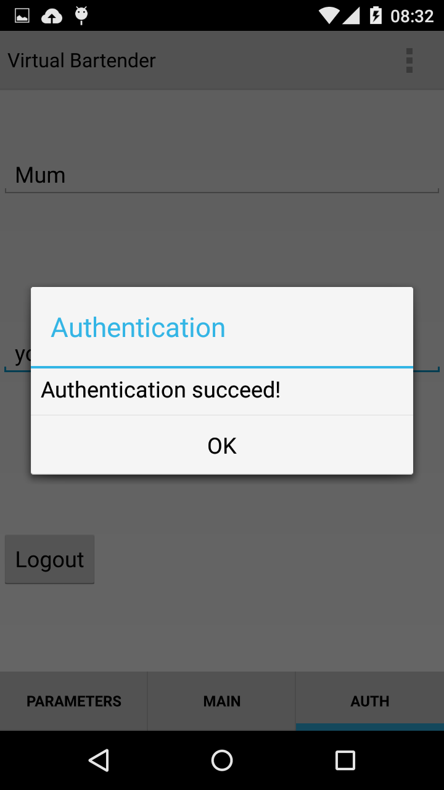
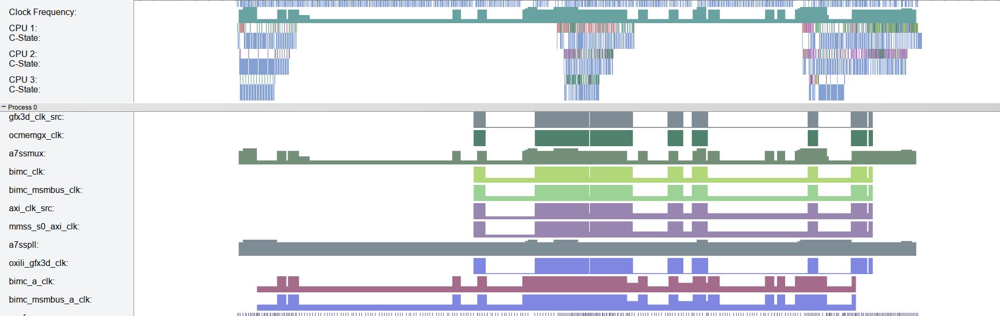

# MobileComputing laboratory work
## Description
This laboratory work ports laboratory [work](https://github.com/MPogoda/sc_1)
for fuzzy computing to android device.

Original laboratory work is virtual bartender — fuzzy logic driven application
that determines how much beer a person should ask based on his overall
drunkness, time left in party, group size and drunk resistance.
## Authors
Original application was created in (2013) by Michael Pogoda, Mykola Previr,
Olya Kulik.

Porting is done by Michael Pogoda, Olya Kulik.

# Methods
Original laboratory work was written using Qt/C++.
Because Qt supports android devices, the same stack will be used to port
application.

## Changing build system
Cross-compiling for android is being done by qt-creator only for QMake
projects.
Because of that project should be ported from CMake build system to QMake.

## QtQuick 2.0
Original laboratory work used QtGUI widgets, written in C++.
When porting to android this UI was not responsible on device.
Because of that it was decided to port UI from QtGUI to QtQuick.

This change separated logic and user interface.
Using QtQuick one can easily substitute QML files to change UI without
recompilation.

Because of that change internal architecture changed drastically.
Now there is one class that has all the application logic and one interface to
former for QtQuick.

# Labs
## Lab 1. Create github page
Here it is.
## Lab 2. UI design
### Starting form

### Authentication form

### Parameters configuration

### Main activity

### Main activity. In progress

### Main activity. End

## Lab 3. Run on mobile platform
Done.
## Lab 4. Authentication
### Authentication form in progress

### Authentication form. Success

## Lab 5. Profiler
[Here](trace.html) is trace report, generated for this application.
### Screenshot

# License
This source code is licensed under terms of MIT license.
See LICENSE file for more information.

